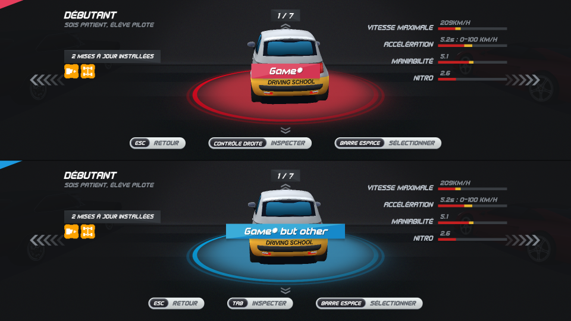

# Cyclocommandeur

System for using a bicycle as a controller in a game.

Any ideas for improving the documentation? Do not hesitate to [open an issue](https://github.com/CLICGameStarProjects/Cyclocommandeur/issues)!

## Table of contents

- [Generalities](#generalities)
- [Setup](#setup)
  * [Assembly](#assembly)
  * [Code](#code)
- [Usage](#usage)
- [Troubleshooting](#troubleshooting)

## Generalities

The remote control is a controller for playing car games, especially [Horizon Chase Turbo](https://store.steampowered.com/app/389140/Horizon_Chase_Turbo/).

The mapping of the controls is done as follows:

| On the bike            | Player 1 | Player 2    | Effect        |
|------------------------|----------|-------------|---------------|
| Pedal                  | W        | Up arrow    | Accelerate    |
| Left handlebar button  | A        | Left arrow  | Turn left     |
| Right handlebar button | D        | Right arrow | Turn right    |
| (soon) Brakes          | S        | Down arrow  | Brake/Reverse |
| (soon) Special button  | Space    | Right Ctrl  | Use nitro     |

> :warning: **Warning!** The mapping works for a QWERT* keyboard, so if you have issues, check that.

## Setup

Skip to [Usage](#usage) if you want to know how to use.

> :warning: **Warning!** If you have already uploaded the code once/if the cyclocommandeur was provided to you by an operator, you do not need to perform the [Code](#code) step!

### Assembly

1) Unfold the bike stand, and insert the rear wheel of the bike into it.

2) Use [serflex](https://fr.wikipedia.org/wiki/Collier_de_serrage_en_plastique) to secure the front wheel to the bike frame.

> :information_source: **Note!** Feel free to take a couple more just in case someone is too happy with the handlebars!

3) Test that everything is stable by getting on the bike and pedalling hard. Feel free to ajust the gears so that the bike is not to loose, but not too hard.

> :information_source: **Note!** Depending on the bike, you may want to use additional weights for the bike stand.

4) If everything is stable, put the buttons on the handlebars, and run the wires to the bike stand following the brake cable. Use electrician's tape to stabilise the buttons and the wires.

> :information_source: **Note!** Make sure the wires will not get into the pedals when using the bike. Feel free to take extra tape if something goes wrong.

5) Make the wire connections using the following table:

| Wire                                         | Goes on           |
|----------------------------------------------|-------------------|
| VCC board                                    | Create a VCC line |
| GND board                                    | Create a GND line |
| Left button (one of the two wires)           | GND line          |
| Left button (the other wire)                 | Digital 4         |
| Right button (one of the two wires)          | GND line          |
| Right button (the other wire)                | Digital 5         |
| Wheel sensor, red wire                       | VCC line          |
| Wheel sensor, black wire                     | GND line          |
| Wheel sensor, one of the two remaining wires | Digital 2         |
| Wheel sensor, remaining wire                 | Digital 3         |

Beware, for Teensy boards, the pinout is quite different!

6) Plug the board's USB cable into a computer, start the game, and test that everything works!

### Code

Please refer to the [Cyclocommandeur main code README](./main/README.md).

## Usage

As stated, we are using [Horizon Chase Turbo](https://store.steampowered.com/app/389140/Horizon_Chase_Turbo/) as our game for that project, but this should work with any other game.

> :information_source: **Note!** This setup requires an operator to handle the menu.

1) Once the game is started, select "Multiplayers".

2) Use each bike's right button to select a profile. If it worked, use the keyboard to confirm (Space and Enter), then use Enter to continue.

3) Select "Campaigns".

4) If you want to take it easy on your players, select "Rookie Series", else, select the traditionnal "World Tour" - or anything you want, really. From there, simply select the circuit you want to play.

5) For car selection, this can be done by the bikes' buttons, but you still need to confirm on the keyboard.

6) Finally, enjoy the game! The operator can restart the game at any point by pressing Escape then R.

> :warning: **Warning!** This controller is sportive. Please remind your players that they should take it easy - it's more of a marathon than a race, really, as the car does not go faster the harder you pedal.

## Troubleshooting

Feel free to use the [test code for hall sensor](./test_hall) to check if you sensor is working correctly. Basically, if you have a 1 when no magnet, but a 0 when magnet, it's working!
