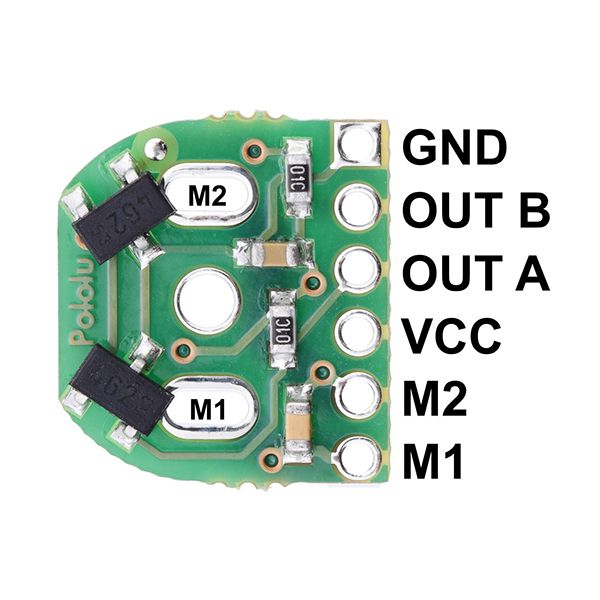
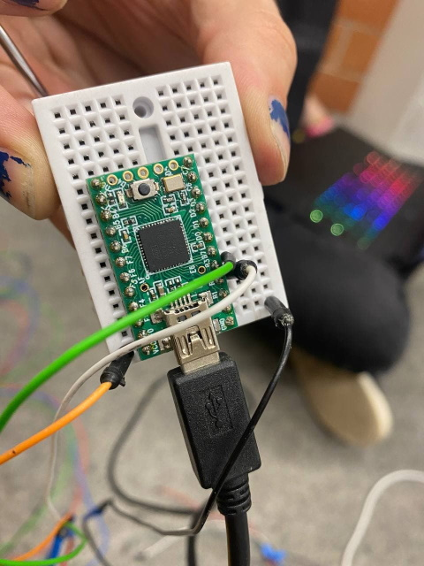

# Test Hall

This piece of code allows you to test if your Hall effect sensor is working. The idea is to simply plug in the sensor, pass a magnet in front of it, and check if there is a change of state.

## A little theory
A Hall effect sensor measures a change in magnetic field. In our case, we will have a small magnet which passes in front of a small sensor, if the magnet is detected, we have a digital signal which gives 0, if not, we have a digital signal which gives 1. It is also possible to have an analogical result, to have a magnetic field intensity, but it does not interest us here.

When we use one sensor, it allows us to detect a rotation, when we have two sensors, it allows us to detect a direction.

## Pinout

Basically, you will have a VCC, a GND, and an output. When the composition is two sensors (e.g., rotary encoder), there are two outputs.

_Something like this._

For this code, you need to connect your sensor to be tested to digital pin 2. If the card is a teensy, this corresponds to pin B2. Don't forget to connect the VCC to the 5V VCC of the board, and the GND to the GND of the board.

_Here is an example_

## Code

Once the code has been uploaded, the serial monitor must be opened (Ctrl/Cmd+Shift+M). If the sensor is correctly connected, the "idle" status should show 1. If the status does not show a 1, check the connections.

When a magnet passes by the sensor, the status should change from 1 to 0. If this is not the case, don't hesitate to try again a few times, because the sensor can be capricious, and the precise location of the magnet to obtain a change of state is annoying.

If, when the magnet passes in front of the sensor, the state changes, then everything works!
